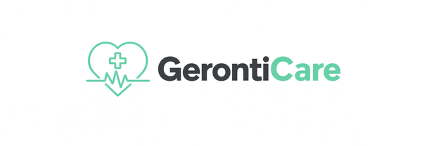

# GerontiCare

<p align="center">
  <a href="#english">🇺🇸 English</a> · <a href="README.pt-BR.md">🇧🇷 Português (Brasil)</a>
</p>

<p align="center">
  
</p>

<p align="center">
  <strong>Open-source electronic health record specialized in geriatric care.</strong><br>
  A multi-tenant system for long-term care facilities (ILPIs) and geriatric clinics.
</p>

<p align="center">
  <a href="https://github.com/claudioorjunior/geronticare/actions/workflows/ci.yml"></a>
  <a href="https://github.com/claudioorjunior/geronticare/blob/main/LICENSE"></a>
  <a href="https://github.com/claudioorjunior/geronticare/releases"></a>
  
  
  
  
</p>

> **⚠️ NOT PRODUCTION READY** — GerontiCare is in early pre-alpha development. **Do not use with real patients or in production environments.** The system may produce incorrect assessments, false positives, or data loss. Use only for development, testing, and evaluation.

---

<a name="english"></a>
## 🇺🇸 English

**GerontiCare** is an open-source electronic health record (EHR) system specialized in geriatric care, designed for **ILPIs** (*Instituições de Longa Permanência para Idosos* — Brazilian long-term care facilities for the elderly) and geriatric clinics.

It unifies the multiprofessional clinical record, the Comprehensive Geriatric Assessment (CGA/AGA), and vital sign monitoring into a single interface designed for aging care — with automatic interpretation of the most widely used geriatric scales (Katz, Lawton, MEEM, GDS-15, MNA, TUG).

### Why this exists

Brazilian ILPIs and geriatric clinics manage complex, multidisciplinary care for elderly residents with limited tools — often a mix of paper charts and spreadsheets. Critical information is scattered across professions (medicine, nursing, physiotherapy, occupational therapy, nutrition, psychology, social work), making it hard to see the full clinical picture.

GerontiCare brings everything together: structured geriatric assessments with automatic scoring, a unified clinical timeline across all professions, and anexos (lab results, imaging, documents) stored securely in S3-compatible storage — all isolated per institution via multi-tenancy.

### Features

- **Multi-tenant by design** — each facility's data is fully isolated by `instituicaoId`
- **Better-Auth authentication** — email/password with secure session management
- **Comprehensive Geriatric Assessment (AGA)** with automatic interpretation of scales:
  - **Katz Index** (0–6) — basic ADL independence
  - **Lawton Scale** (0–8) — instrumental ADL (IADL)
  - **MEEM** (0–30) — Mini-Mental State Examination
  - **GDS-15** (0–15) — Geriatric Depression Scale
  - **MNA** (0–14) — Mini Nutritional Assessment
  - **TUG** (seconds) — Timed Up and Go, fall risk
- **Multiprofessional clinical record** — evolution notes, prescriptions, exams, incidents
- **Unified clinical timeline** — interleaves records + CGAs + vital signs by date
- **Vital signs tracking** — BP, heart rate, respiratory rate, temperature, SpO₂, glucose, weight, height
- **S3-compatible attachments** — presigned URLs for direct browser upload (AWS S3, MinIO, Cloudflare R2, Backblaze B2)
- **Type-safe API** via tRPC + Zod validation end-to-end

### Tech stack

| Layer | Choice |
|---|---|
| Frontend | Next.js 16 (App Router) + React 19 |
| API | tRPC v11 + superjson (type-safe end-to-end) |
| Database | PostgreSQL + Drizzle ORM |
| Auth | Better-Auth (Drizzle adapter) |
| Validation | Zod 4 |
| Styling | Tailwind CSS 4 |
| Storage | AWS S3 SDK (S3-compatible) |
| Language | TypeScript 5 (strict) |

### Quick start (development)

```bash
# 1. Clone

git clone https://github.com/claudioorjunior/geronticare.git
cd geronticare

# 2. Install
npm install

# 3. Configure (development — embedded PGlite DB, no PostgreSQL needed)
cp .env.development.example .env.local
# DEV_AUTH_BYPASS=true already grants a seed admin session with no login

# 4. Run
npm run dev
# open http://localhost:3000
```

> Dev uses an embedded PGlite database (seeded automatically) — no `db:push` needed.
> The `db:push`/`db:generate` scripts target an external PostgreSQL via `DATABASE_URL`.

### Production environment

```bash
# Build and serve with PostgreSQL
cp .env.production.example .env.production
# fill in DATABASE_URL, AUTH_SECRET, AUTH_URL, S3_* vars
npm run build
npm run start
```

The process exposes `GET /api/health` as a cache-free liveness check for monitoring and load balancers.

#### How the environment separation works

- **`NODE_ENV` is always set by Next.js**: `npm run dev` → `development`, `npm run build`/`npm run start` → `production`. You never set it manually.
- **Dev access bypass** (`lib/trpc/server.ts`): the seed admin session only activates when **both** `NODE_ENV=development` and `DEV_AUTH_BYPASS=true` are present — it is *fail-closed* by construction and can never activate in a production build, even if the variable leaks into production env.
- **Developer convenience**: set `DEV_OVERRIDE_USER_ID` to impersonate any seed user (e.g. a `usuario` read-only account) to test role behavior.
- **Production**: real login via Better-Auth (email/password). A missing or misconfigured `AUTH_*` variable makes auth fail closed — the app never falls back to anonymous access.

Releases target production deployments with Node.js and PostgreSQL; contributors should fork `main` and open PRs from feature branches.

### Project structure

```
geronticare/
├── app/
│   ├── api/
│   │   ├── auth/[...all]/route.ts   # Better-Auth handler
│   │   ├── anexos/upload-url/        # S3 presigned URL endpoint
│   │   └── trpc/[trpc]/route.ts      # tRPC handler
│   ├── layout.tsx
│   └── providers.tsx
├── lib/
│   ├── auth/
│   │   ├── index.ts                  # Better-Auth server config
│   │   └── client.ts                 # Better-Auth React client
│   ├── db/
│   │   ├── schema.ts                 # 10 tables + 3 enums
│   │   └── index.ts                  # Drizzle client
│   ├── storage/
│   │   └── s3.ts                     # S3-compatible storage helpers
│   ├── trpc/
│   │   ├── server.ts                 # Context + procedures (auth, multi-tenant)
│   │   ├── client.ts                 # tRPC React client
│   │   ├── root.ts                   # Root router
│   │   └── routers/                  # Domain routers
│   │       ├── instituicoes.ts
│   │       ├── usuarios.ts
│   │       ├── pacientes.ts
│   │       ├── avaliacoesGeriatricas.ts
│   │       ├── registros.ts
│   │       └── sinaisVitais.ts
│   └── validations/
│       └── escalas.ts                # Zod schemas + scale interpretation
└── docs/
    ├── PRD.md                        # Product Requirements Document
    └── ROADMAP.md                    # Development roadmap
```

### Scripts

| Script | Description |
|---|---|
| `npm run dev` | Development server |
| `npm run build` | Production build |
| `npm run start` | Production server |
| `npm run lint` | ESLint |
| `npm run type-check` | TypeScript (no emit) |
| `npm run db:generate` | Generate SQL migration |
| `npm run db:push` | Push schema to database |
| `npm run db:studio` | Open Drizzle Studio |

### Roadmap

- [x] **M0**: Repository, CI, branch protection, bilingual docs
- [x] **M1**: Better-Auth, multi-tenant enforcement, instituicoes/usuarios/pacientes routers
- [x] **M2**: AGA with scale interpretation, registros + unified timeline, sinais vitais, S3 attachments
- [x] **M3**: Release v0.1.0 on GitHub
- [ ] **M4**: Full UI (dashboard, scale forms, visual timeline)
- [ ] **M5**: LGPD compliance audit
- [ ] **M6**: Analytics dashboard
- [ ] **M7**: React Native mobile app
- [ ] **M8**: FHIR R4 interoperability

See [ROADMAP.md](ROADMAP.md) for the full plan and [PRD.md](PRD.md) for detailed requirements.

### Contributing

PRs welcome! See [CONTRIBUTING.md](CONTRIBUTING.md) for the contribution guide. Open an issue first to discuss the approach.

### License

MIT — see [LICENSE](LICENSE). Use it, fork it, build services around it.

### Maintainer

Built by [@claudioorjunior](https://github.com/claudioorjunior) as part of the **Integra** family of open-source tools for Brazilian eldercare.

---

<p align="center">
  <a href="README.pt-BR.md">🇧🇷 Ler em Português (Brasil)</a>
</p>
